# Semantic Segmentation

The goal of this project is to use Fully Convolutional Network (FCN) to classify pixels of road images.

### Solution

Network architecture follows solution described in paper [Fully Convolutional Networks for Semantic Segmentation](https://arxiv.org/pdf/1605.06211.pdf).

Last fully connected layers of pre-trained VGG-16 network was replaced with 1x1 convolutions. Decoder layers were
added to the network, so result is up-sampled to original images size.

Skip connections was used by combining results of earlier layers with result of upsampling layers. Without this some information
would be lost and up-sampling result would be poorer.

#### Optimizer

Cross entropy loss with Adam optimizer was used. L2 regularization was used to avoid overfitting.

#### Training

Final network was trained using following parameters:

Parameter     |  Value
:------------:|:--------:
epochs        | 50
batch size    | 8
keep_prob     | 0.5, 
learning_rate | 0.0010

### Result

Running network for 50 epochs gave following result:


Cross entropy loss was continuously going smaller and would probably get even better result when training longer 
(but there's risk of overfitting): 

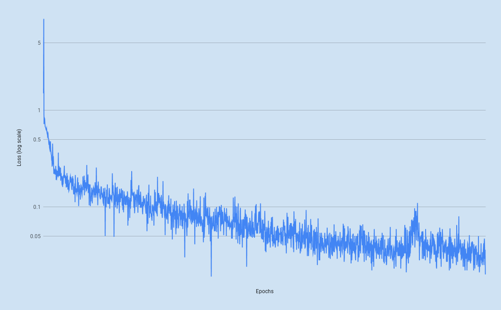

#### 10 epochs vs 50 epochs

Here are some more interesting images, where network trained for 10 epochs struggled, but network trained for 50 epoch did quite well:

10 epochs                                         |  50 epochs
:------------------------------------------------:|:-------------------------:
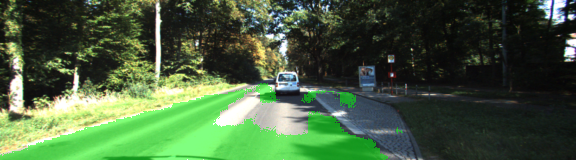  |  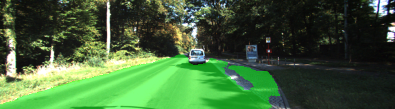
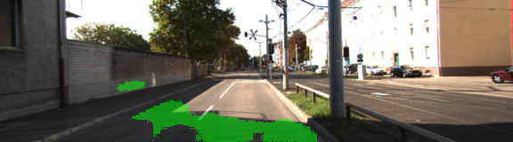  |  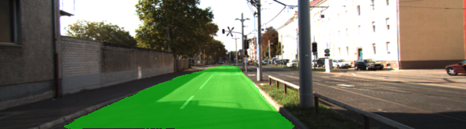
|  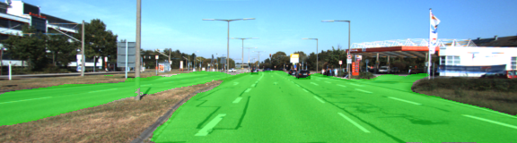
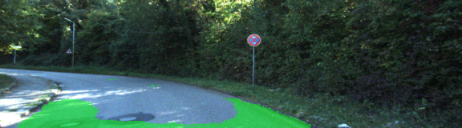  |  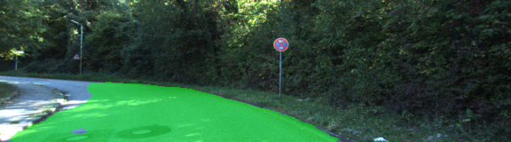
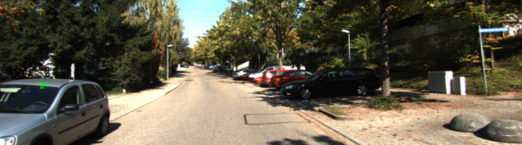  |  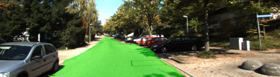
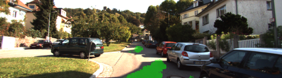  |  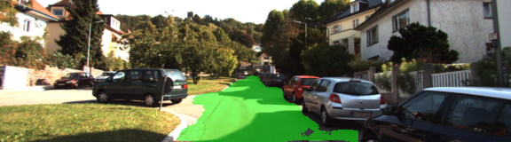

### Setup
##### GPU
`main.py` will check to make sure you are using GPU - if you don't have a GPU on your system, you can use AWS or another cloud computing platform.
##### Frameworks and Packages
Make sure you have the following is installed:
 - [Python 3](https://www.python.org/)
 - [TensorFlow](https://www.tensorflow.org/)
 - [NumPy](http://www.numpy.org/)
 - [SciPy](https://www.scipy.org/)

You may also need [Python Image Library (PIL)](https://pillow.readthedocs.io/) for SciPy's `imresize` function.

##### Dataset
Download the [Kitti Road dataset](http://www.cvlibs.net/datasets/kitti/eval_road.php) from [here](http://www.cvlibs.net/download.php?file=data_road.zip).  Extract the dataset in the `data` folder.  This will create the folder `data_road` with all the training a test images.

##### Run
Run the following command to run the project:
```
python main.py
```
**Note:** If running this in Jupyter Notebook system messages, such as those regarding test status, may appear in the terminal rather than the notebook.